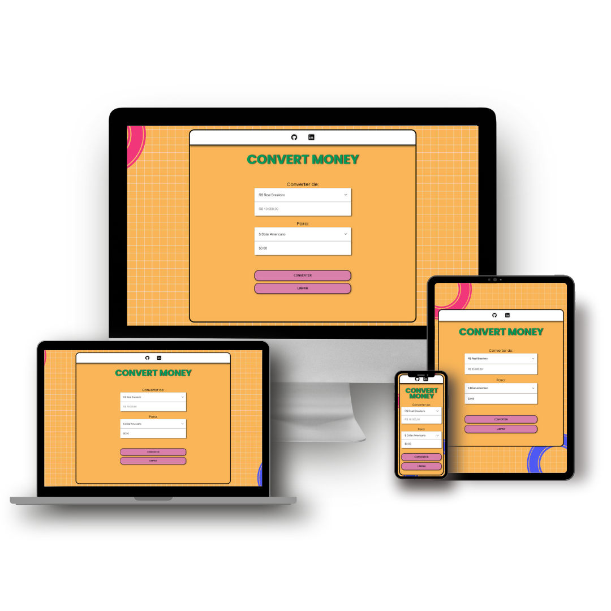

# ConvertMoney
 

  <a href="#house-About-the-project">About</a>&nbsp;&nbsp;&nbsp;|&nbsp;&nbsp;&nbsp;
  <a href="#computer-Technologies">Technologies</a>

 

## :house: About the project

This project is a currency converter developed using only HTML, CSS, and JavaScript.
The converter is easy to use and has a responsive design that adapts to different screen sizes.
Moreover, the code was written in an organized and modular way, allowing for future updates and maintenance.
  
Este projeto é um conversor de moedas desenvolvido utilizando HTML, CSS e JavaScript.
O conversor é fácil de usar e possui um design responsivo, adaptando-se a diferentes tamanhos de tela.
Além disso, o código foi escrito de forma organizada e modular, permitindo futuras atualizações e manutenções.

  

## :computer: Technologies 

  

  

  

